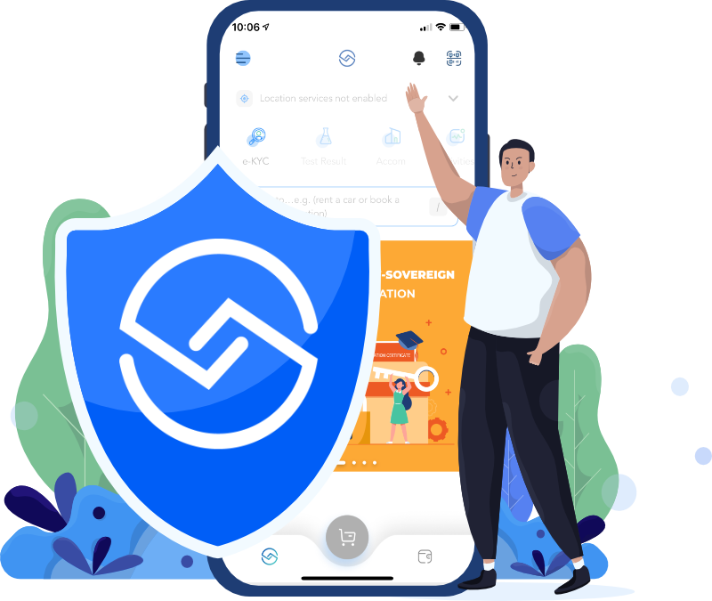
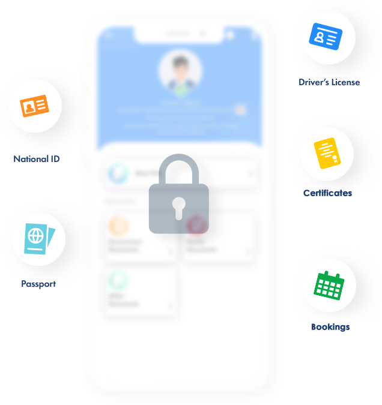
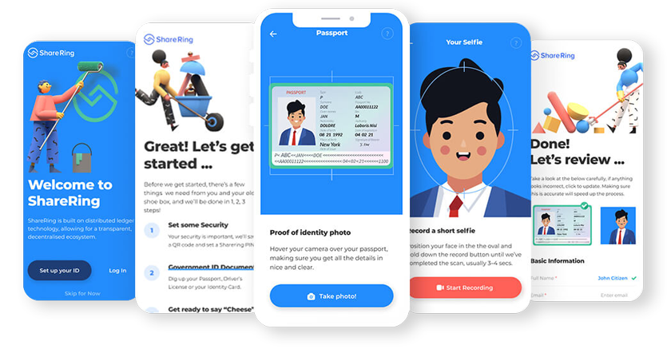

## Blockchain Case Study: ShareRing

### Introduction
 Today, sharing economy is growing so rapidly (estimated roughly 670 billion in the next five years) and people live in the world in which almost anything can be borrowed or loaned. However there is no single marketplace where people can go to find these things. ShareRing focused to build an ecosystem where there is a secure access, fast connect and reliable payment system for such services anywhere in the world. Blockchain plays a pivotal role in such environment to function seamlessly and is the key technology to solve many problems which arise from online sharing economy.

### What is it
ShareRing is a Australian-based blockchain company established in 2018 by Serial Entrepreneur and Blockchain innovator Tim Bos who has extensive experience in telecommunications, finance and transportation. Tim among 5 other founders realized the potential to disrupt the fragmented sharing economy with blockchain technology and developed a ShareRing on-demand platform by bringing together sharing services across all industries and geographies. 

ShareRing uses their own custom blockchain network built on top of the Tendermint blockchain. This immutable platform is fast, flexible and scalable where users could securely share data without losing control and ownership of it. It also offers B2B platform and a set of API's for other online travel agencies (OTA's) and companies such as AirBnB or Herz to integrate with. Once the partners plugin to ShareRing platform they could have access to a community of customers i.e. essentially white-labelling a product or service and loading it into a sharing economy marketplace. So both indiviuals and businesses can take advantage of their platform. It is therefore built up to be interoperable.

ShareRing completed $62 million ICO their own crypto back in 2018 commenced selling 4 billion of its SHR tokens. SHR function as the digital utility token that drives sharing transactions to be writen to the ShareRing ledger while SharePay (SHRP) act as the currency in the ShareLedger blockchain. By having two token strategy, no konwledge of blockchain/crytpo is requried to utilize the ShareRing ecosystem. This has contributed to the development of ShareRing ecosystem in a great deal. The current market cap of SHR is AUD$90 million as of Sep 21.  

## Why this matters
ShareRing App allow users to utilize their mobile as a tool to integrate with various sharing and other services where identification, autorization or confirmation is required. These services include travel booking, insurance verification, membership identification, registration and rental of various products, ticket checking at venues, Covid-19 vaccination proof, employment credentials and many more. Through their ecosystem, users can securely access, store, connect and pay for services anywhere in the world without going through timely and painful process or a hussle of multiple identity checks.

The CEO of ShareRing expresses his view of ShareRing adoption on travel indsutry. 'The technology behind travel has been stuck in the dark ages for so long. So many inefficiency along the way for travellers to book in and check into a hotel. Firstly traveller's identity check, signing up on a website, enter information, confirm all and get to the hotel and tell the hotel all of the information again. Sometimes they give you a paper to fill it out by hand. What if this process can be avoided by one click.' There will be no more juggling handing over passports, travel documents or bank cards during one's trip.

ShareRing ID enable users to store their valuable documents and data, such as their passport, National ID, Driver Licenses, certificate etc in an secure and encrypted ShareRing Vault. This means that the encrypto data never leaves the user's device and only so called 'fingerprint' i.e. hash of the data and documentation (documentation of thirdparty who verifies the document e.g. medical center will be the validator for approval of COVID-19 vaccine) will be stored on the blockchain. Self-Sovereign Identity(SSI) model makes it possible for the users to have a full control of their private information and Decentralized Identity (DID) ensures that users are always asked for permission before any information is sent to a third party. The fact that the data are secured at the hand of users their data is only accessible to those who are permitted by the user. This means the data is highly protected and there is a minimum risk of data theft or information leakage. 

Flexibility of the blockchain also helps speed up adoption of other platform such as government and businesses to integrate the passport app on exsisting solutions without using the ShareRing brand. For example, ShareRing has launched the world's first anonymous blockchain based contact-tracing passport that can be integrated with e-visa on arrival systems (eVOA), travel insurance companies, airlines, hotels and retail shops in an aim to revive the $9 trillion global tourism industry. While many contact-tracing apps have undergone harsh scrutiny since the pandemic has began, ShareRing's SSI model overcomes majority of hurdle of securing data integrity by ensuring data privacy through their anonymous distributed ledger cryptography.

## Why this may be interesting 

* It will be extremely convinient if ShareRing is available anywhere around the World. If all service providers and government bodies integrate with ShareRing's eco system there will be no more hussle of going through your private data looking for a piece of information that might be scattered everywhere. It also enhances better management of one's privacy data.

* App can be used for a variety of purposes for example, ShareRing use Chinese tech firm Tencent cloud services such as optical character recognition (OCR) and facial recognition to help travellers in Asia use digital identification. This enhances identity verification and data management for countries especially hit by Covid-19 pandemic. ShareRing system watermarks over the top of the image of the passport when they travel, how long they stay etc. So when a person arrives at a hotel all the information is shared and processed smoothly. The hash, verification record and watermark are stored in blockchain which makes perfectly tracable in case of information leakage. Watermark also reduces the chance of it being reused. 

* Recently ShareRing announced a pilot program to digitise the KYC(Know Your Customer) process for financial institution based in the Caribbean region. The KYC pilot will enable insurance companies, credit unions and other financial institutions to receive their customer ID and support docs in an encrypted digital format through mobile. This will provide online solution e.g. identity verification and credit approval for Caribbean region to eliminate time-consuming account sign-up processes while ensuring the institutions operate within the regulatory framework. 

* ShareRing has launched ERC20 SHR staking on Launchpool. Launchpool is a new blockchain project that realigns stakeholder incentives to create a more fair and equal investing experience.  SHR use POS model which allows individual to pool for a full node with 50% of the total transaction fees paid to node holder. ShareToken SHR is currently available via Kucoin, Uniswap and Binance etc. It is a fiat-backed stable coin which allows local cash out with no FX fee with low transaction fee. 

* ShareRing believes the blockchain technology can remove the biggest headache of internet, the security hole i.e. use of 'password'. Sign up for services scan QR codes in a second. QR code is used to read data rather than NFC. NFC can be more convenient but ShareRing believes that QR codes is more universal in that every single phone has a camera on it today. 

### Conclusion

It is undoubtful that blockchain technologies have changed the way people see the potential of sharing economy and how security of privacy data is perceived and managed today. The key strengh of ShareRing is that it is interoperable so that third parties and users can integrate with them without having a deep knowledge of blockchain to enjoy the benefit of ShareRing ecosystem. Use of technologies such as SSI and DID has enable the company to integerate with user's personal data without having to risk them. SHR has a potential to be used globally and like many other blockchain networks may increase in value as the sharing economy grows. There are so many industries yet to disrupt with blockchain technologies and ShareRing ecosystem is just seeing big oppotunities coming ahead.  

References:

https://sharering.network/

https://www.smartcompany.com.au/startupsmart/news/sharering-raises-3-8-million-seed-round-before-62-million-ico/

https://www.forbes.com/sites/nisaamoils/2020/08/02/sharering-uses-blockchain-to-solve-self-sovereign-identity-and-proof-of-health-simultaneously/?sh=1732db113e61

https://www.scmp.com/tech/big-tech/article/3110177/tencents-cloud-tech-helps-blockchain-firm-manage-digital-records-get

https://cointelegraph.com/news/can-blockchain-e-passports-help-save-the-tourism-industry

https://thepaypers.com/digital-identity-security-online-fraud/sharering-launches-pilot-program-to-digitise-kyc-process--1250851
