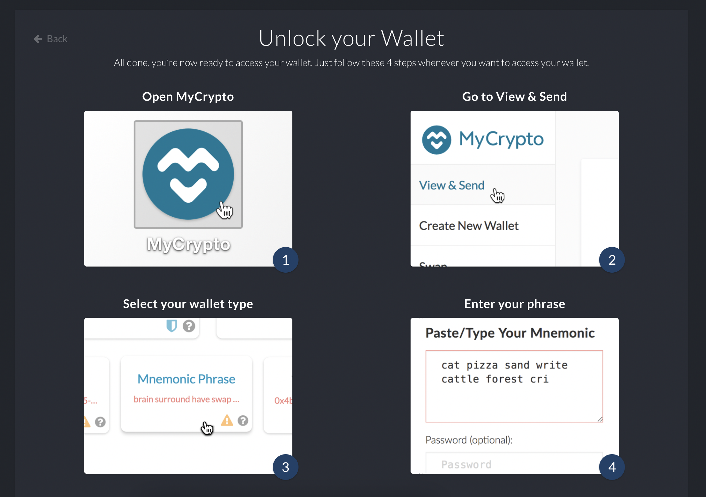

# POA Development Chain Manual


### Objective:
The purpose of this instruction is to set up a custom blockchain for new users to help them understand how Proof of Authority Development Chain works and can be implemented.

### Environment & prerequisits:
1. Terminal 
2. Go Ethereum tool
3. MyCrypto

# Instructions
---
## A. Open an account with MyCrypto app

* Select Create New Wallet and generate mnemonic key.


* Remember to keep the mnemonic key generated in phrase order as it will be required to access your account later. Once you input the phrase in order press confirm botton to proceed.


* Below is the steps you need to follow in order to access to your account later.


* Now we log into the account and confirm addresses to be linked to our will be created custom network. Make sure you are connected to Etherium Network at this stage. 
* Type Mnemonic Pharse you recorded earlier in order. Leave space between the words.


* Once you log in, you will see below screen. We will connect the first address later in our custom network. 


## B. Creating Nodes
* Next, we will generate two nodes with account addresses. These addresses will serve as our pre-approved sealer addresses.

* Create accounts for two nodes for the network with a separate datadir for each using geth.

* Each node should be created inside Go ethereum tool folder.

* It will ask you to input a password. Put 'password' as password. It will be used later in Testing on MyCrypto section.

```./geth --datadir node1 account new```

```./geth --datadir node2 account new```

* Keep record of the two address keys in the picture below and save it into your notepad for later use. 

Node 1 Address key:  292294eB5200619575BF3A7F5b5D7d2Db66583Bf

Node 2 Address key: 191e5bA8B452c3f522D2A786056Eb3a9f019d6a4


## C. Generate New Genesis Block From Scratch 

* Open terminal and navigate to the Go Etherum Tool folder and run puppeth.

```$ ./puppeth```

1. Network Name: oicnet
2. Configure genesis
3. Create new genesis from scratch
4. Clique - proof-of-authority
5. blocks take 15 = default
6. Which accounts allowed to seal?
* This is where you input address 1 and address 2 in B. Please note you need to remove 0x when copying and paste.
7. Which accounts should be pre-funded? Same as 6.
8. Precompile addresses = yes
9. Network ID = 5927


* Now exit puppeth by using the Ctrl+C keys combination.

## D. Initialize each node with the new testanet.json.

D-1. Create json files using puppeth in terminal. 

    ```$ ./puppeth```

1.Specify your network. i.e. oicnet

2.Manage existing genesis

3.Export genesis configurations

4.Which folder to save the genesis specs into? Just press enter. 


* Now exit puppeth by using the Ctrl+C keys combination. 

D-2. Now we will use geth to initalize node 1 and node 2 by typing below cmd in terminal.

```./geth --datadir node1 init testinet.json```

```./geth --datadir node2 init testinet.json```


## E. Now the nodes can be used to begin mining blocks.

Run the nodes in separate terminal windows with below cmds

Node1:

./geth --datadir node1 --unlock "SEALER_ONE_ADDRESS" --mine --rpc --allow-insecure-unlock

So cmd should be like this:

```./geth --datadir node1 --unlock "292294eB5200619575BF3A7F5b5D7d2Db66583Bf" --mine --rpc --allow-insecure-unlock```

once running, copy bootnodes "enode://SEALER_ONE_ENODE_ADDRESS@127.0.0.1:30303" as in the picture below.


Node2:

./geth --datadir node2 --unlock "SEALER_TWO_ADDRESS" --mine --port 30304 --bootnodes "enode://SEALER_ONE_ENODE_ADDRESS@127.0.0.1:30303"

paste bootnodes "enode://SEALER_ONE_ENODE_ADDRESS@127.0.0.1:30303" copied in node 1.

So cmd for node 2 should look like this:

```../geth --datadir node2 --unlock "191e5bA8B452c3f522D2A786056Eb3a9f019d6a4" --mine --port 30304 --bootnodes "enode://c97caf56c9dfe1391876fdf2f8b982cc32962f00ae3dcbdddd50ef9446be6c5903890c9a2a31d9314ee46255fb3dd7036946f70b49c8d76c8c25aac964feb239@127.0.0.1:30303"```

POA blockchain should be working now.


# Testing on MyCrypto

1. Open MyCrypto app, and click change Network at the bottom left.


2. Click :"Add Custom Node", then a set up page will pop up. Add custom network information you set in the genesis. Make sure to select "Custom" from the dropdown menu as this will add more information to input such as URL and Chain ID. Once filled in, click "Save & Use Custom Node" button. 


3. You can confirm if you are using the custom node or not from the screen below. You should see a blue light next to your node's name if you are connected to the node.


4. Now from "Keystore File" access keystore files from the directory into MyCrypto. For password, use 'password' you registered in section B. If successful, you should see a extraordinary amount of ETH in your wallet. 


5. We will then to transfer 10,000 ETH from our account 1 to account 2.


6. Confirm transaction and click 'Send'. Then select 'Check TX status' at the bottom of the screen'. This will log you out but proceed to exit.


7. We can see that the transaction has been successful. 


8. We can also check the transaction status in terminal.


# Additional 

1. Now you may wonder if we could transfer ETH into the account we created on MyCrypto at section A. 


2. Answer is yes! as long as you stay in oicnet!

